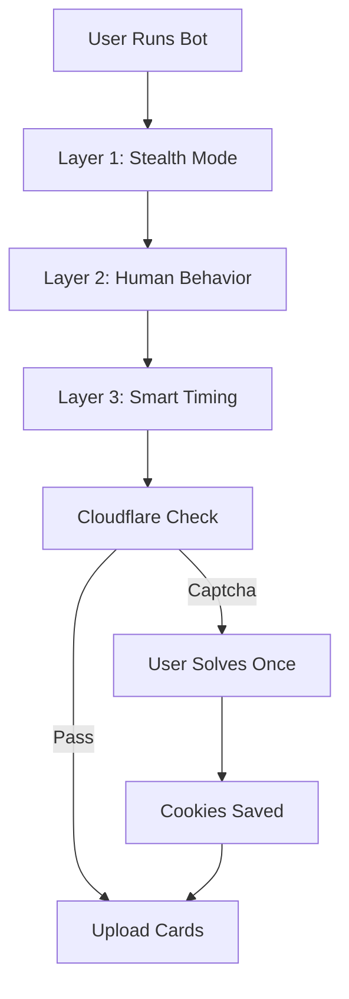
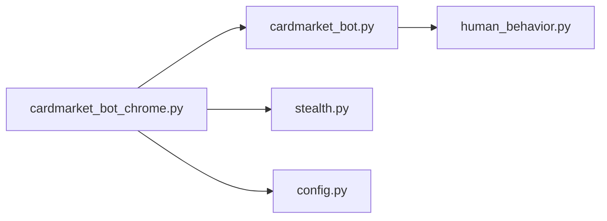

# 🎴 Cardmarket Pokemon Bot

<div align="center">


**Automated bot to upload Pokemon cards to Cardmarket with advanced anti-Cloudflare protection**

[Features](#-features) •
[Installation](#-installation) •
[Usage](#-usage) •
[Configuration](#-configuration) •
[Documentation](#-documentation)

</div>

---

## 📖 Table of Contents

- [Overview](#-overview)
- [Features](#-features)
- [How It Works](#-how-it-works)
- [Installation](#-installation)
- [Usage](#-usage)
  - [Quick Start](#quick-start)
  - [Advanced Options](#advanced-options)
- [CSV Format](#-csv-format)
- [Configuration](#-configuration)
- [Anti-Cloudflare System](#-anti-cloudflare-system)
- [Project Structure](#-project-structure)
- [Troubleshooting](#-troubleshooting)
- [Contributing](#-contributing)
- [License](#-license)

---

## 🌟 Overview

This bot automates the process of uploading Pokemon cards to Cardmarket from CSV files. It features a sophisticated 3-layer anti-detection system that bypasses Cloudflare protection with 90-95% effectiveness.

### Why This Bot?

- ⏱️ **Saves Time**: Upload hundreds of cards automatically
- 🛡️ **Stealth Mode**: 21 anti-detection techniques
- 🎭 **Human Behavior**: Simulates real user interaction
- 🍪 **Persistent Sessions**: Solve captcha once, never again
- 📊 **Detailed Logging**: Track progress in real-time
- 🌐 **Multi-language**: Supports 6 languages
- 🌐 **WARP Compatible**: Works with Cloudflare WARP for even better success rate

---

## ✨ Features

### Core Functionality
- 🤖 **Automated Card Upload** from CSV files
- 📝 **Batch Processing** with progress tracking
- 🔄 **Resume Capability** after interruptions
- ✅ **Form Validation** before submission

### Anti-Detection System
- 🛡️ **21 Stealth Techniques** (webdriver hiding, fingerprint spoofing, etc.)
- 🎭 **Human Behavior Simulation** (mouse movements, scrolling, reading pauses)
- ⏱️ **Smart Timing** (random delays, rate-limit avoidance)
- 🍪 **Session Persistence** (cookies saved between runs)

### Customization
- 🎯 **3 Operation Modes**: Fast, Balanced, Safe
- ⚙️ **Configurable Delays** and pause intervals
- 🌐 **Language Support**: English, Spanish, French, German, Italian, Portuguese
- 📊 **Detailed Logs** with colored output
- 🛡️ **Cloudflare WARP Support**: Works seamlessly with WARP for enhanced protection

---

## 🔧 How It Works

### 3-Layer Protection System



#### **Layer 1: Technical Stealth**
- Hides webdriver properties
- Spoofs browser fingerprints
- Randomizes Canvas/WebGL signatures
- Sets realistic navigator properties

#### **Layer 2: Behavioral**
- Random scrolling patterns
- Mouse movements
- Reading pauses (1-3 seconds)
- Occasional "distractions"

#### **Layer 3: Temporal**
- Random delays between cards (17-37s)
- Long pauses every 8 cards (3-5 minutes)
- Never repeats the same pattern

**Result**: ~90-95% captcha avoidance rate

---

## 🚀 Installation

### Prerequisites

- **Python 3.8+**
- **Google Chrome** (installed on system)
- **Cardmarket Account** with seller permissions

### Method 1: With Virtual Environment (Recommended)

```bash
# 1. Clone the repository
git clone https://github.com/YOUR_USERNAME/CardmarketPokemon.git
cd CardmarketPokemon

# 2. Create virtual environment
python -m venv venv

# 3. Activate virtual environment
# Windows:
venv\Scripts\activate
# Linux/Mac:
source venv/bin/activate

# 4. Install dependencies
pip install -r requirements.txt
playwright install chromium

# 5. Prepare your CSV file (see CSV Format section)
```

### Method 2: System-Wide Installation

```bash
# 1. Clone the repository
git clone https://github.com/YOUR_USERNAME/CardmarketPokemon.git
cd CardmarketPokemon

# 2. Install dependencies
pip install -r requirements.txt
playwright install chromium

# 3. Prepare your CSV file
```

### Verification

```bash
# Check Python version
python --version  # Should be 3.8 or higher

# Check Playwright installation
playwright --version

# List installed packages
pip list
```

### Optional: Install Cloudflare WARP (Highly Recommended)

For best results against Cloudflare captchas:

1. **Download WARP**: https://1.1.1.1/
2. **Install** for your operating system
3. **Activate** before running the bot
4. **Result**: Significantly lower captcha rate

**Why?** WARP uses Cloudflare's own network, which has high IP reputation and is trusted by Cloudflare's anti-bot system.

---

## 💻 Usage

### Quick Start

**Windows:**
```bash
# Using the launcher (automatically uses virtual environment if available)
run_bot_chrome.bat example_cards.csv
```

**Linux/Mac:**
```bash
# With virtual environment
source venv/bin/activate
python cardmarket_bot_chrome.py example_cards.csv
```

### First Run Workflow

1. **Chrome Opens Automatically**
   ```
   [INFO] Starting Chrome with STEALTH MODE...
   [OK] 21 anti-detection techniques active
   ```

2. **Solve Cloudflare Captcha** (if appears)
   - Check the "Verify you are human" box
   - Wait for verification
   - **Only needed once!** Cookies are saved

3. **Manual Login**
   - Login to your Cardmarket account
   - Return to console and press Enter

4. **Automatic Upload**
   ```
   [1/10] MEG 001
   [2/10] MEG 002
   ...
   [OK] PROCESS COMPLETED
   ```

### Advanced Options

#### Option 1: Direct Python Execution
```bash
# With virtual environment
venv\Scripts\python.exe cardmarket_bot_chrome.py your_cards.csv

# Without virtual environment
python cardmarket_bot_chrome.py your_cards.csv
```

#### Option 2: Using activate_venv.bat (Windows)
```bash
# Activate environment
activate_venv.bat

# Run bot
python cardmarket_bot_chrome.py your_cards.csv

# Deactivate when done
deactivate
```

#### Option 3: Custom Configuration
```bash
# Edit config.py first to change mode (fast/balanced/safe)
# Then run
run_bot_chrome.bat your_cards.csv
```

### Operation Modes

| Mode | Speed | Delay/Card | Pause Interval | Captcha Risk | Best For |
|------|-------|------------|----------------|--------------|----------|
| **Fast** | ⚡ Fast | 10-20s | Every 15 cards | High | Small batches |
| **Balanced** | ⚖️ Moderate | 17-37s | Every 8 cards | Low | **Recommended** |
| **Safe** | 🐌 Slow | 40-90s | Every 5 cards | Very Low | Large batches |

**Time Estimates** (20 cards):
- Fast: ~8-10 minutes
- Balanced: ~20-25 minutes
- Safe: ~35-45 minutes

**🌐 With Cloudflare WARP:**
- Captcha risk: **Reduced by ~50-70%** across all modes
- Recommended: **Balanced mode + WARP** = Best speed/safety ratio

---

## 📋 CSV Format

### Required Columns

Your CSV file must contain these exact column names (case-sensitive):

| Column | Type | Description | Example |
|--------|------|-------------|---------|
| `CODE` | String | Card code/number | `MEG 001` |
| `QUANTITY` | Integer | Number of cards | `2` |
| `UNIT_PRICE` | Decimal | Price per card in EUR | `0.50` or `0,50` |
| `QUALITY` | String | Card quality | `NORMAL`, `HOLO`, `REVERSE HOLO` |
| `CONDITION` | String | Card condition | `Near Mint`, `Excellent`, etc. |
| `LANGUAGE` | String | Card language | `English`, `Spanish`, etc. |

### Example CSV

```csv
CODE,QUANTITY,UNIT_PRICE,QUALITY,CONDITION,LANGUAGE
MEG 001,2,0.08,NORMAL,Near Mint,English
MEG 002,1,0.15,REVERSE HOLO,Near Mint,English
MEG 003,3,0.25,HOLO,Excellent,Spanish
SV01 001,5,0.10,NORMAL,Lightly Played,French
```

### Supported Values

**Quality:**
- `NORMAL` - Regular card
- `HOLO` - Holographic card
- `REVERSE HOLO` - Reverse holographic card

**Condition:**
- `Mint` - Perfect condition
- `Near Mint` - Almost perfect
- `Excellent` - Minor wear
- `Good` - Visible wear
- `Lightly Played` / `Light Played` - Some wear
- `Played` - Heavy wear
- `Poor` - Very damaged

**Language:**
- `English`, `Spanish`, `French`, `German`, `Italian`, `Portuguese`

### Tips

- Use commas (`,`) or periods (`.`) for decimals - both work
- Card codes are case-insensitive
- Empty lines are ignored
- Comments are not supported

---

## ⚙️ Configuration

### config.py

```python
# ==========================================
# OPERATION MODE
# ==========================================
BOT_MODE = 'balanced'  # Options: 'fast', 'balanced', 'safe'

# ==========================================
# CUSTOM SETTINGS (Advanced)
# ==========================================
CUSTOM_SETTINGS = {
    'between_cards': (30, 60),     # (min, max) seconds between cards
    'break_interval': 10,           # Pause every X cards
    'break_duration': (4, 6),      # (min, max) minutes for long pause
}
```

### Recommended Configurations

**For Speed:**
```python
BOT_MODE = 'fast'
```

**For Safety:**
```python
BOT_MODE = 'safe'
```

**For Custom Timing:**
```python
BOT_MODE = 'balanced'
CUSTOM_SETTINGS = {
    'between_cards': (25, 50),
    'break_interval': 6,
    'break_duration': (3, 4),
}
```

---

## 🛡️ Anti-Cloudflare System

### How It Works

The bot uses a sophisticated 3-layer approach:

#### 1. **Stealth Mode** (21 Techniques)

<details>
<summary>Click to see all techniques</summary>

1. ✅ Webdriver property hidden
2. ✅ Chrome runtime object spoofed
3. ✅ Permission API mocked
4. ✅ Plugins array spoofed (PDF, NaCl)
5. ✅ Mimetypes array spoofed
6. ✅ Languages array realistic
7. ✅ Platform set to Win32
8. ✅ Vendor set to Google Inc.
9. ✅ Hardware concurrency spoofed
10. ✅ Device memory spoofed
11. ✅ User agent data realistic
12. ✅ Battery API mocked
13. ✅ Connection API spoofed
14. ✅ Screen dimensions realistic
15. ✅ Timezone set correctly
16. ✅ Canvas fingerprint randomized
17. ✅ WebGL vendor spoofed
18. ✅ Selenium variables removed
19. ✅ Notification permissions handled
20. ✅ Console debug messages
21. ✅ Iframe detection evasion

</details>

#### 2. **Human Behavior Simulation**

```python
# Random scrolling
scroll_amount = random.randint(100, 500)

# Mouse movements
for _ in range(random.randint(1, 3)):
    x = random.randint(200, 1200)
    y = random.randint(200, 800)
    page.mouse.move(x, y)

# Reading pauses
time.sleep(random.uniform(1, 3))

# Occasional distractions (20% chance)
if random.random() < 0.2:
    time.sleep(random.uniform(3, 8))
```

#### 3. **Smart Timing**

```python
# Between cards: 17-37 seconds (random)
delay = random.uniform(17, 37)

# Every 8 cards: 3-5 minute pause
if cards_processed % 8 == 0:
    pause_minutes = random.uniform(3, 5)
    time.sleep(pause_minutes * 60)
```

### Effectiveness

- **First run**: May show captcha (solve once)
- **Following runs**: 90-95% no captcha
- **With cookies saved**: Almost 100% success

### Tips to Maximize Success

1. ✅ Use `balanced` or `safe` mode
2. ✅ Don't modify delay settings too aggressively
3. ✅ Upload during off-peak hours (late night)
4. ✅ Limit batches to 20-30 cards per session
5. ✅ **Use Cloudflare WARP** (recommended) - See note below
6. ✅ Avoid datacenter VPNs (they increase detection)

### 🌐 Using Cloudflare WARP (Recommended)

[Cloudflare WARP](https://1.1.1.1/) is a free VPN service that can **significantly improve success rate**:

**Why WARP helps:**
- ✅ Uses Cloudflare's own infrastructure (high-reputation IPs)
- ✅ Not flagged as typical VPN/datacenter IPs
- ✅ Better success rate bypassing Cloudflare protection
- ✅ Free and easy to install

**How to use:**
1. Download [WARP](https://1.1.1.1/) for your OS
2. Install and activate WARP
3. Run the bot as normal
4. **Result**: Lower captcha rate observed by users

**Note**: Regular VPNs (especially datacenter IPs) often increase detection. WARP is different because it uses Cloudflare's trusted network.

---

## 📁 Project Structure

```
CardmarketPokemon/
│
├── 📄 cardmarket_bot.py              # Base bot class (DO NOT delete)
├── 🎯 cardmarket_bot_chrome.py       # Main bot with stealth mode
├── 🛡️ stealth.py                     # Anti-detection techniques
├── 🎭 human_behavior.py              # Behavior simulation
├── ⚙️ config.py                      # Configuration file
│
├── 🚀 run_bot_chrome.bat             # Windows launcher
├── 📖 activate_venv.bat              # Virtual environment activator
│
├── 📋 example_cards.csv              # Example CSV file
├── 📦 requirements.txt               # Python dependencies
├── 🚫 .gitignore                     # Git ignore rules
│
├── 📚 README.md                      # This file
├── 📘 GITHUB_SETUP.md                # GitHub upload guide
│
└── 📂 venv/                          # Virtual environment (not in Git)
    └── ...
```

### File Dependencies



**Important**: All Python files are required. Don't delete any `.py` files.

---

## 🆘 Troubleshooting

### Common Issues

#### Issue: "Search box not found"

**Cause**: Website structure changed

**Solution**:
```python
# Edit cardmarket_bot.py, line ~158
search_selectors = [
    "input[id='ProductSearchInput']",  # Try this first
    "input[name='search']",             # Add alternatives
    "input[type='search']",
]
```

#### Issue: Captcha keeps appearing

**Cause**: Too fast or patterns detected

**Solutions**:
1. **Install Cloudflare WARP** (recommended) - [Download here](https://1.1.1.1/)
2. Change to `safe` mode in `config.py`
3. Reduce batch size (10-15 cards per run)
4. Upload during off-peak hours (2 AM - 6 AM local time)
5. Wait 30 minutes between runs
6. Clear cookies and start fresh (delete `chrome_bot_profile/`)

**Pro Tip**: Many users report **90%+ success** with WARP + Safe mode combination.

#### Issue: Cards not being added

**Causes & Solutions**:

| Cause | Solution |
|-------|----------|
| Wrong CSV format | Check column names match exactly |
| Not logged in | Verify you logged in manually |
| Wrong selectors | Website changed, update selectors |
| Too fast | Increase delays in config.py |

#### Issue: Chrome won't open

**Solution**:
```bash
# Check Chrome installation
where chrome  # Windows
which google-chrome  # Linux

# Reinstall Playwright browsers
playwright install chromium
```

#### Issue: Virtual environment not working

**Solution**:
```bash
# Delete and recreate
rmdir /s venv  # Windows
rm -rf venv    # Linux/Mac

# Recreate
python -m venv venv
venv\Scripts\activate
pip install -r requirements.txt
```

### Debug Mode

Enable debug logging:

```python
# In config.py
DEBUG = True
```

### Getting Help

1. Check the [Troubleshooting](#-troubleshooting) section
2. Search [existing issues](https://github.com/YOUR_USERNAME/CardmarketPokemon/issues)
3. Open a new issue with:
   - Python version (`python --version`)
   - Operating system
   - Error message (full traceback)
   - Steps to reproduce
   - CSV file example (anonymized)

---

## 🤝 Contributing

Contributions are welcome! Here's how:

### Development Setup

```bash
# 1. Fork the repository
# 2. Clone your fork
git clone https://github.com/YOUR_USERNAME/CardmarketPokemon.git
cd CardmarketPokemon

# 3. Create virtual environment
python -m venv venv
source venv/bin/activate  # or venv\Scripts\activate on Windows

# 4. Install dependencies
pip install -r requirements.txt
playwright install chromium

# 5. Create a branch
git checkout -b feature/your-feature-name

# 6. Make changes and test
python cardmarket_bot_chrome.py example_cards.csv

# 7. Commit and push
git add .
git commit -m "Add: your feature description"
git push origin feature/your-feature-name

# 8. Open a Pull Request
```

### Areas for Contribution

- 🌐 **Multi-game support** (MTG, YuGiOh, etc.)
- 🔍 **Better selector detection** (auto-adapt to website changes)
- 🎨 **GUI interface** (Tkinter or PyQt)
- 📊 **Progress dashboard** (real-time statistics)
- 🧪 **Unit tests** (pytest)
- 📝 **More languages** (Japanese, Korean, etc.)
- 🔧 **Performance improvements**
- 📖 **Better documentation**

### Code Style

- Follow PEP 8
- Add docstrings to functions
- Comment complex logic
- Keep functions under 50 lines
- Use type hints where possible

---

## ⚠️ Disclaimer

**Educational Purpose**: This bot is for educational purposes and personal use only.

**Terms of Service**: Automated tools may violate Cardmarket's terms of service. Use at your own risk. The authors are not responsible for:
- Account bans or suspensions
- Lost data or incorrect uploads
- Any other consequences of using this tool

**Recommendation**: Always review cards before uploading and use responsibly.

---

## 📝 License

MIT License - Copyright (c) 2025

Permission is hereby granted, free of charge, to any person obtaining a copy
of this software and associated documentation files (the "Software"), to deal
in the Software without restriction, including without limitation the rights
to use, copy, modify, merge, publish, distribute, sublicense, and/or sell
copies of the Software, and to permit persons to whom the Software is
furnished to do so, subject to the following conditions:

The above copyright notice and this permission notice shall be included in all
copies or substantial portions of the Software.

THE SOFTWARE IS PROVIDED "AS IS", WITHOUT WARRANTY OF ANY KIND.

[Full License](LICENSE)

---

## 🙏 Acknowledgments

- **[Playwright](https://playwright.dev/)** - Browser automation framework
- **[puppeteer-extra-plugin-stealth](https://github.com/berstend/puppeteer-extra)** - Inspiration for stealth techniques
- **Pokemon TCG Community** - For feedback and testing
- **Cardmarket** - For providing the platform

---

## 📞 Support & Contact

### Get Help

- 📖 **Documentation**: Read this README thoroughly
- 🐛 **Bug Reports**: [Open an issue](https://github.com/YOUR_USERNAME/CardmarketPokemon/issues)
- 💬 **Questions**: [Discussions](https://github.com/YOUR_USERNAME/CardmarketPokemon/discussions)
- ⭐ **Star the repo** if you find it useful!

### Maintainer

Created and maintained by [@YOUR_USERNAME](https://github.com/YOUR_USERNAME)

---

<div align="center">

**Made with ❤️ for the Pokemon TCG community**

⭐ Star this repo if it helped you!

[Report Bug](https://github.com/YOUR_USERNAME/CardmarketPokemon/issues) •
[Request Feature](https://github.com/YOUR_USERNAME/CardmarketPokemon/issues) •
[Contribute](https://github.com/YOUR_USERNAME/CardmarketPokemon/pulls)

</div>
